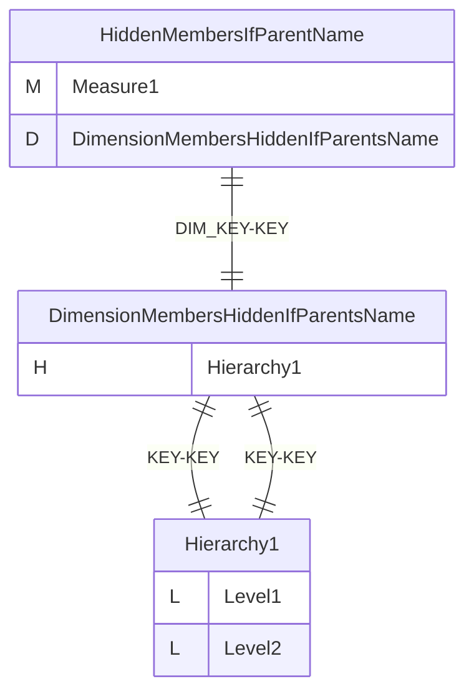
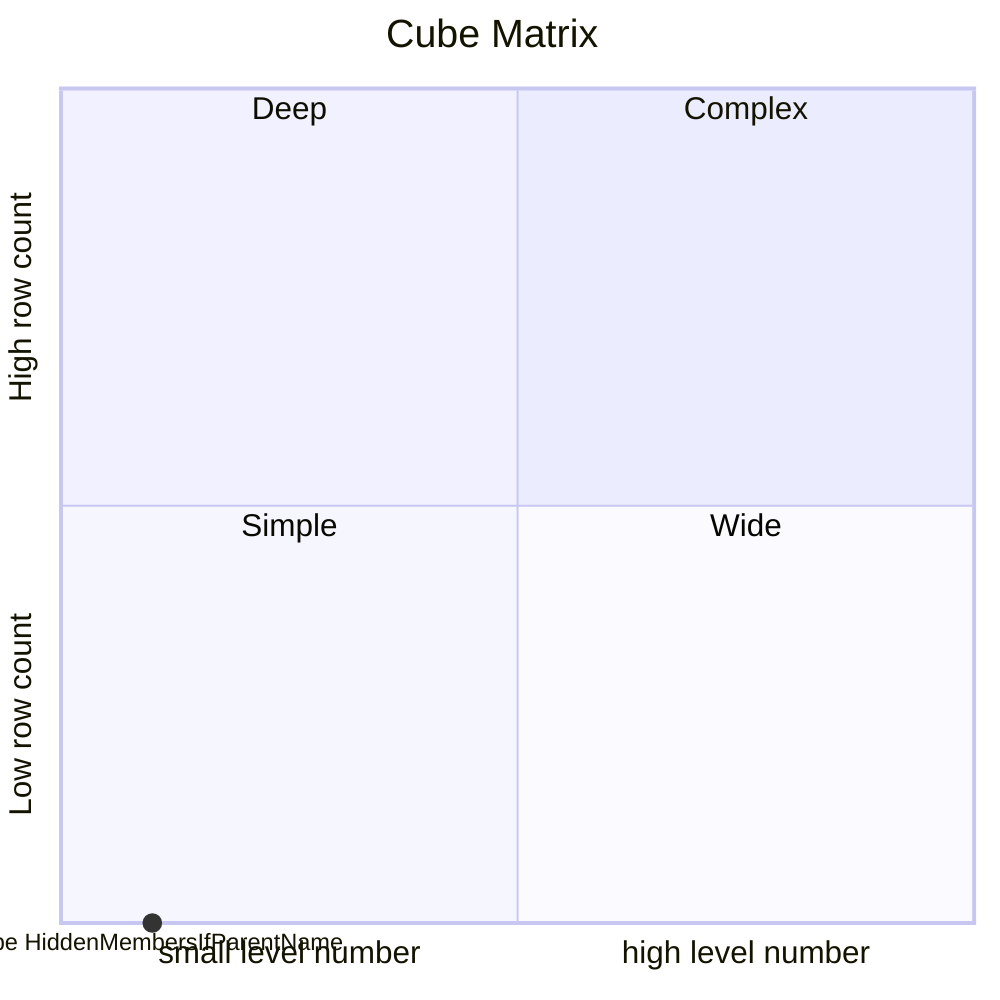
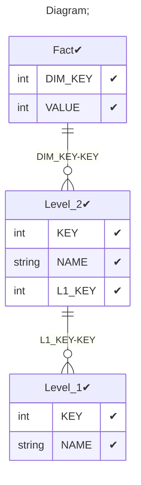

# Documentation
### CatalogName : tutorial_31-02_Level_hideMemberIf_IfParentsName
### Schema Minimal_Single_Hierarchy_Hidden_Members : 
### Public Dimensions:

    DimensionMembersHiddenIfParentsName

##### Dimension "DimensionMembersHiddenIfParentsName":

Hierarchies:

    Hierarchy1

##### Hierarchy Hierarchy1:

Tables: "Level_2,Level_1"

Levels: "Level1, Level2"

###### Level "Level1" :

    column(s): KEY

###### Level "Level2" :

    column(s): KEY

---
### Cubes :

    HiddenMembersIfParentName

---
#### Cube "HiddenMembersIfParentName":

    

##### Table: "Fact"

##### Dimensions:
##### Dimension: "DimensionMembersHiddenIfParentsName -> DimensionMembersHiddenIfParentsName":

### Cube "HiddenMembersIfParentName" diagram:

---

---
### Cube Matrix for Minimal_Single_Hierarchy_Hidden_Members:

---
### Database :
---

---
## Validation result for schema Minimal_Single_Hierarchy_Hidden_Members
## WARNING : 
|Type|   |
|----|---|
|DATABASE|Table: Schema must be set|
