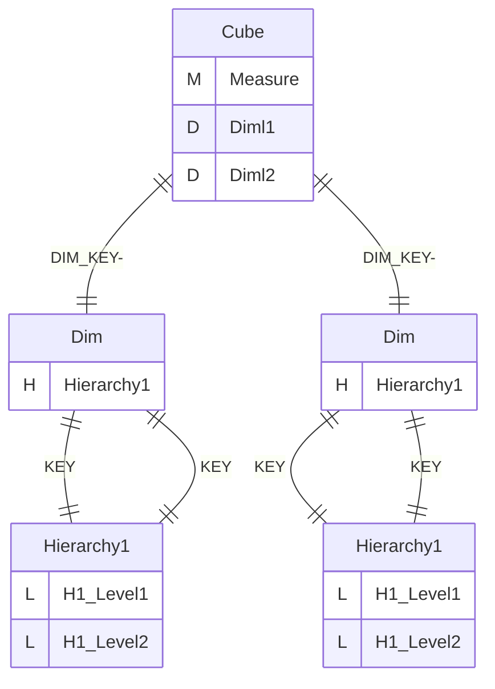
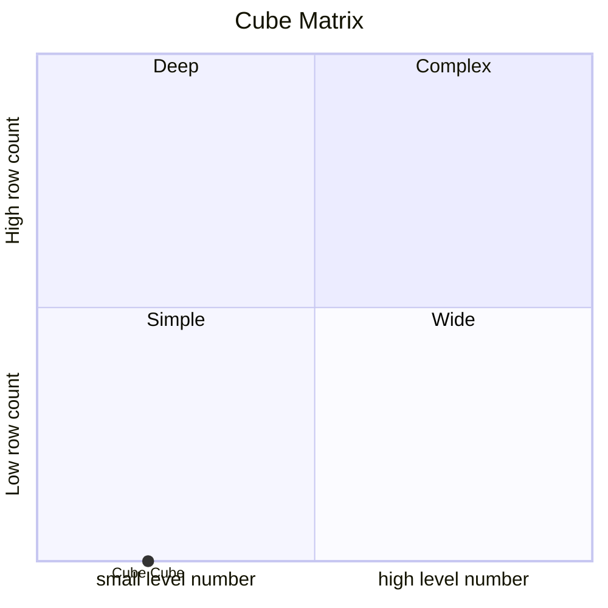
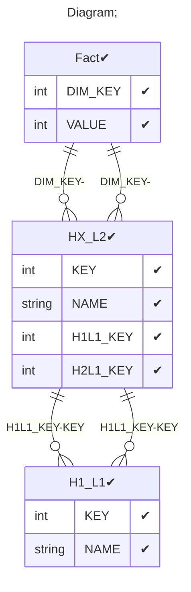

# Documentation
### CatalogName : tutorial_Cube_with_CubeDimension_with_level_attribute
### Schema Minimal_Cube_with_cube_dimension_level_with_property : 

    
		 
		A basic OLAP schema with DimensionUsage with level attribute
    Level attribute in DimensionUsage uses for optimize sql inner join
    Level attribute is name of the level to join to
    If not specified joins to the lowest level of the dimension
		
  
### Public Dimensions:

    Dim

##### Dimension "Dim":

Hierarchies:

    Hierarchy1

##### Hierarchy Hierarchy1:

Tables: "HX_L2,H1_L1"

Levels: "H1_Level1, H1_Level2"

###### Level "H1_Level1" :

    column(s): KEY

###### Level "H1_Level2" :

    column(s): KEY

---
### Cubes :

    Cube

---
#### Cube "Cube":

    

##### Table: "Fact"

##### Dimensions:
##### Dimension: "Diml1 -> Dim":

##### Dimension: "Diml2 -> Dim":

### Cube "Cube" diagram:

---

---
### Cube Matrix for Minimal_Cube_with_cube_dimension_level_with_property:

---
### Database :
---

---
## Validation result for schema Minimal_Cube_with_cube_dimension_level_with_property
## ERROR : 
|Type|   |
|----|---|
|SCHEMA|Hierarchy: PrimaryKeyTable and PrimaryKey must be set for Join in dimension with name Dim|
|SCHEMA|Hierarchy: PrimaryKey must be set for Join in dimension with name Dim|
## WARNING : 
|Type|   |
|----|---|
|DATABASE|Table: Schema must be set|
