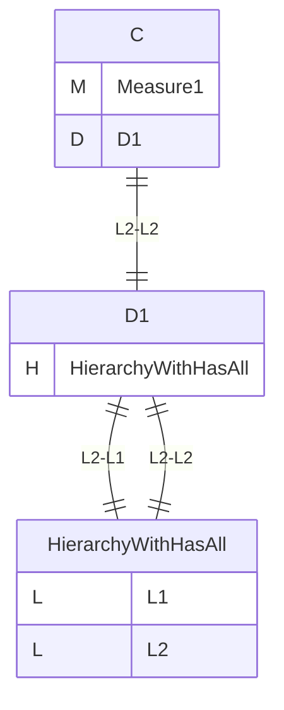
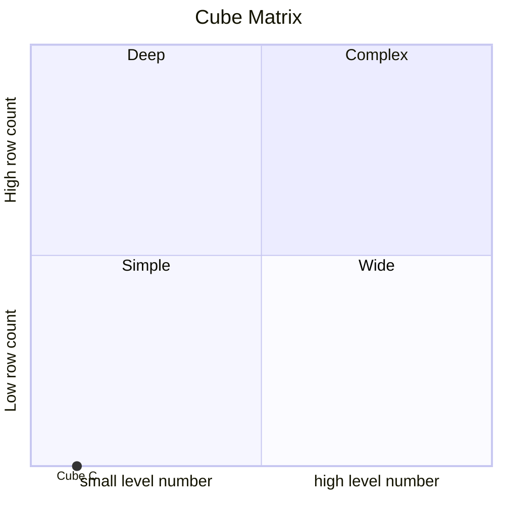
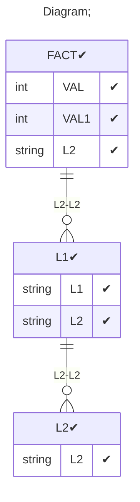

# Documentation
### CatalogName : tutorial_for_writeback_with_wrong_writeback_table
### Schema tutorial_for_writeback_with_wrong_writeback_table : 

    
      writeback with fact as table
		
  
### Public Dimensions:

    D1

##### Dimension "D1":

Hierarchies:

    HierarchyWithHasAll

##### Hierarchy HierarchyWithHasAll:

Tables: "L1,L2"

Levels: "L1, L2"

###### Level "L1" :

    column(s): L1

###### Level "L2" :

    column(s): L2

---
### Cubes :

    C

---
#### Cube "C":

    

##### Table: "FACT"

##### Dimensions:
##### Dimension: "D1 -> D1":

### Cube "C" diagram:

---

---
### Cube Matrix for tutorial_for_writeback_with_wrong_writeback_table:

---
### Database :
---

---
## Validation result for schema tutorial_for_writeback_with_wrong_writeback_table
## ERROR : 
|Type|   |
|----|---|
|SCHEMA|Measure with name Measure11 absent in cube with name C for write back|
|DATABASE|Column VAL does not exist in table FACTWB1|
|DATABASE|Column L2 does not exist in table FACTWB1|
|DATABASE|Table FACTWB1 does not exist in database|
## WARNING : 
|Type|   |
|----|---|
|DATABASE|Table: Schema must be set|
