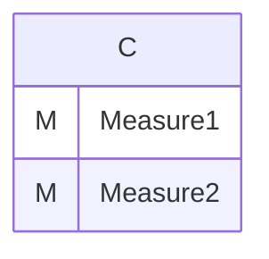
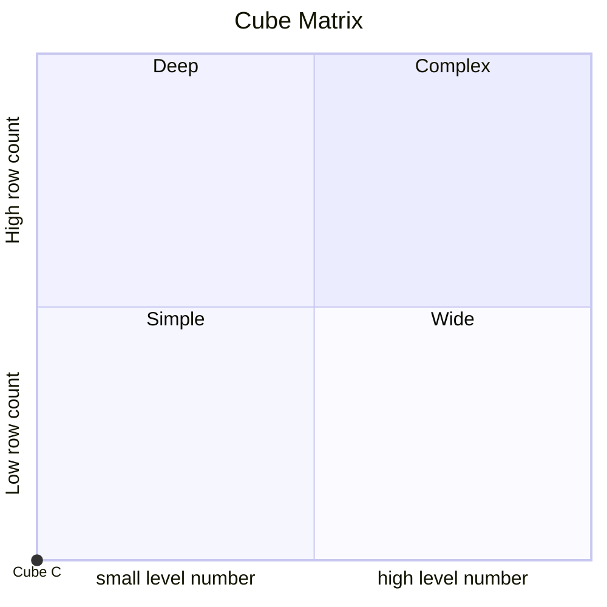
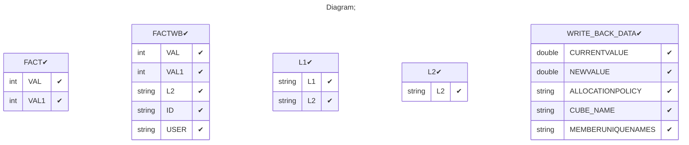

# Documentation
### CatalogName : tutorial_for_writeback_without_dimension
### Schema tutorial_for_writeback : 

    
      writeback with fact as table with only measure
		
  
---
### Cubes :

    C

---
#### Cube "C":

    

##### Table: "FACT"

### Cube "C" diagram:

---

---
### Cube Matrix for tutorial_for_writeback:

---
### Database :
---

---
